# APU CodeCamp Management System — C# WinForms Project


## Overview

APU CodeCamp Management System is a cleaned portfolio version of an Introduction to Object-Oriented Programming academic group project.

It is a C# Windows Forms desktop application connected to Microsoft SQL Server. The system manages additional coaching sessions through four roles: Administrator, Lecturer, Trainer, and Student.

## Team Contribution

This was developed as a group academic project. The team worked together on the Microsoft SQL Server database, role-based workflows, user interface design, navigation structure, and interaction polish across the Administrator, Lecturer, Trainer, and Student modules.

## System Roles

| Role | Main Functions |
|---|---|
| Administrator | Registers/removes trainers, assigns trainers to modules and levels, views trainer feedback, views monthly income reports, updates profile. |
| Lecturer | Registers/enrolls students, approves requests, deletes completed students, views and filters student lists, updates profile. |
| Trainer | Adds/updates/deletes class information, views enrolled and paid students, sends feedback, updates profile. |
| Student | Views schedules, sends additional coaching requests, cancels pending requests, views invoices, makes payments, updates profile. |

## Project Features

- C# Windows Forms desktop application
- Microsoft SQL Server database connectivity
- Login authentication
- Role-based dashboard navigation
- CRUD operations
- Student course request workflow
- Lecturer approval workflow
- Trainer class management workflow
- Student payment and invoice workflow
- Profile management
- Input validation
- Error handling
- Object-oriented structure using classes, methods, and objects

## Technologies Used

- C#
- Windows Forms
- Microsoft SQL Server
- Visual Studio
- Object-Oriented Programming
- ADO.NET
- SqlConnection / SqlCommand
- GitHub

## Object-Oriented Programming Concepts

Classes organize role-specific forms and logic for the Administrator, Lecturer, Trainer, and Student modules.

Objects are created and used based on the logged-in role. After login authentication, the system redirects the user to the correct dashboard and loads the role-specific forms.

Methods handle actions such as login, dashboard redirection, course requests, approvals, payments, feedback submission, profile updates, and database operations.

Services/helper logic manages database connection and SQL execution so repeated database access behavior can be reused across the application.

## Database Integration

The system uses Microsoft SQL Server to store and retrieve application data. SQL operations support login authentication, role identification, course requests, approvals, payments, schedules, feedback, and reports.

The `Database` folder contains cleaned portfolio-ready SQL scripts with fictional demo data.

- `Database/schema.sql` creates the database structure.
- `Database/sample-data.sql` inserts clean fictional demo records.
- `Database/setup-instructions.md` explains setup steps.
- `Database/database-cleanup-report.md` documents the cleanup process.

## Project Structure

```text
.
|-- Database/
|   |-- database-cleanup-report.md
|   |-- sample-data.sql
|   |-- schema.sql
|   `-- setup-instructions.md
|-- diagrams/
|   |-- class-diagram.png
|   `-- use-case-diagram.png
|-- screenshots/
|   |-- admin-manage-trainers-form.png
|   |-- admin-monthly-income-report.png
|   |-- admin-trainer-feedback-form.png
|   |-- base-form.png
|   |-- lecturer-approve-requests.png
|   |-- lecturer-manage-students.png
|   |-- lecturer-view-students.png
|   |-- login-form.png
|   |-- profile-form.png
|   |-- student-courses.png
|   |-- student-fees.png
|   |-- student-homepage.png
|   |-- trainer-enrolled-students.png
|   |-- trainer-manage-classes.png
|   `-- trainer-send-feedback.png
|-- SourceCode/
|   |-- APUCC_Project.slnx
|   `-- APUCC/
|       |-- Forms/
|       |-- Properties/
|       |-- Services/
|       |-- UI/
|       |-- App.config
|       |-- APUCC_Project.csproj
|       |-- APU_Code_Camp_Admin.resx
|       `-- Program.cs
|-- .gitignore
`-- README.md
```

## Diagrams

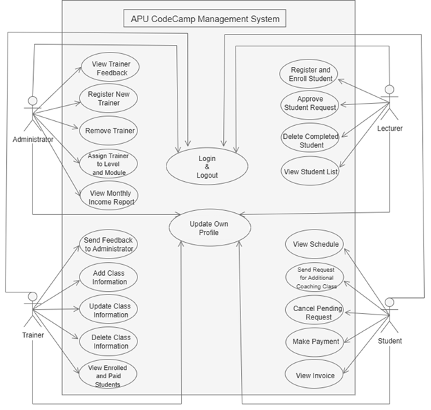

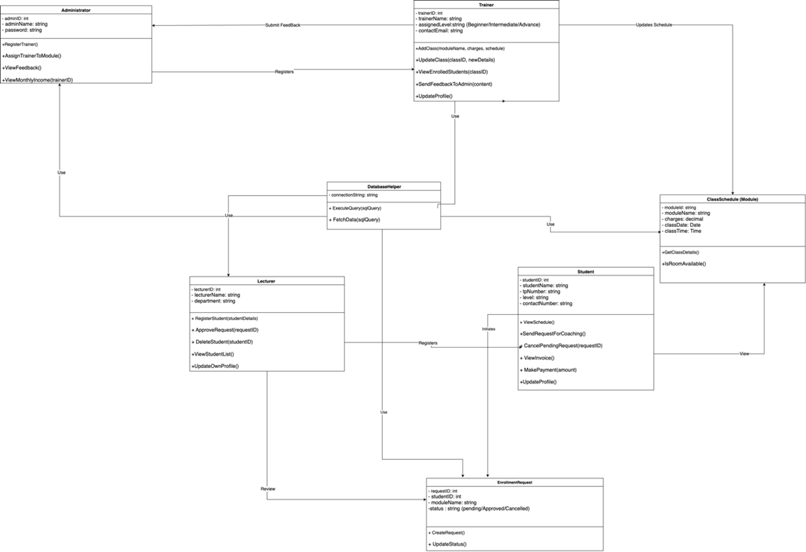

## Screenshots

### Login and Profile

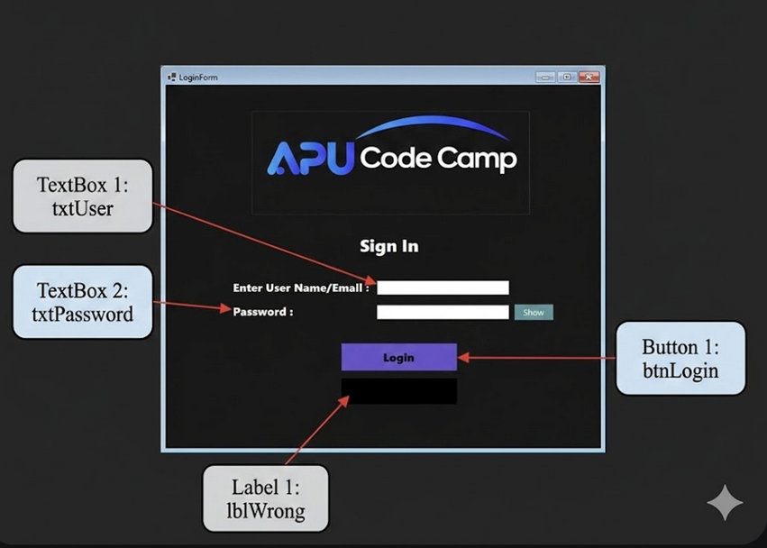

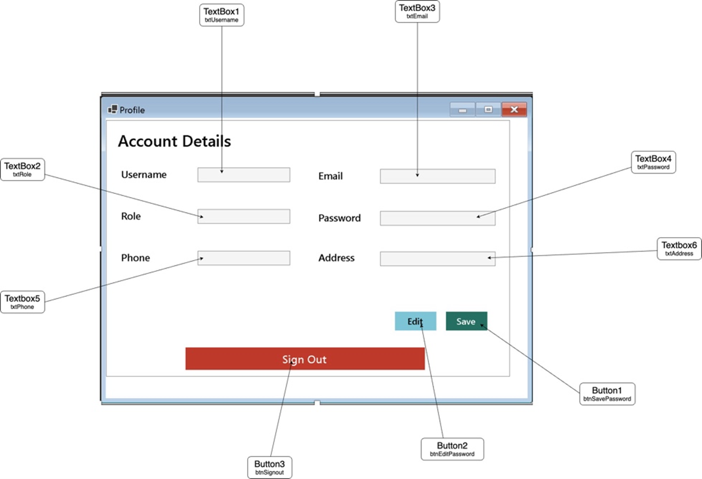

### Administrator

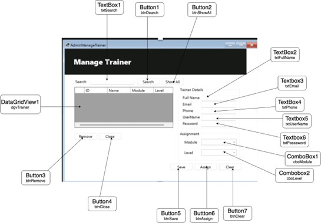

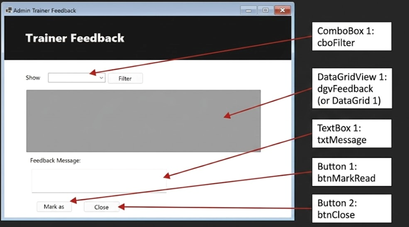

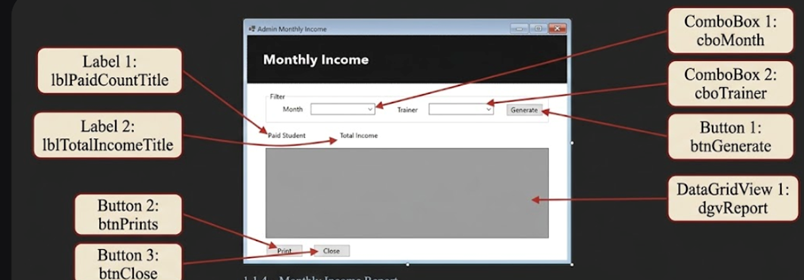

### Lecturer

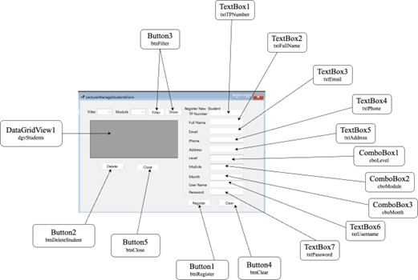

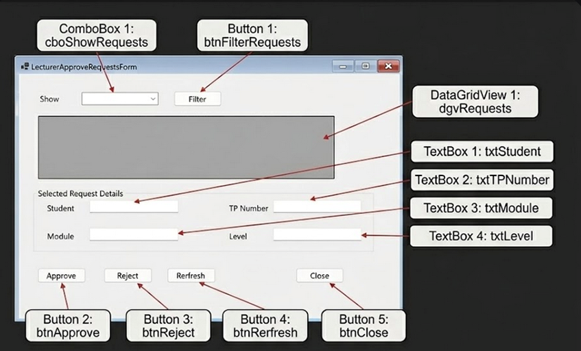

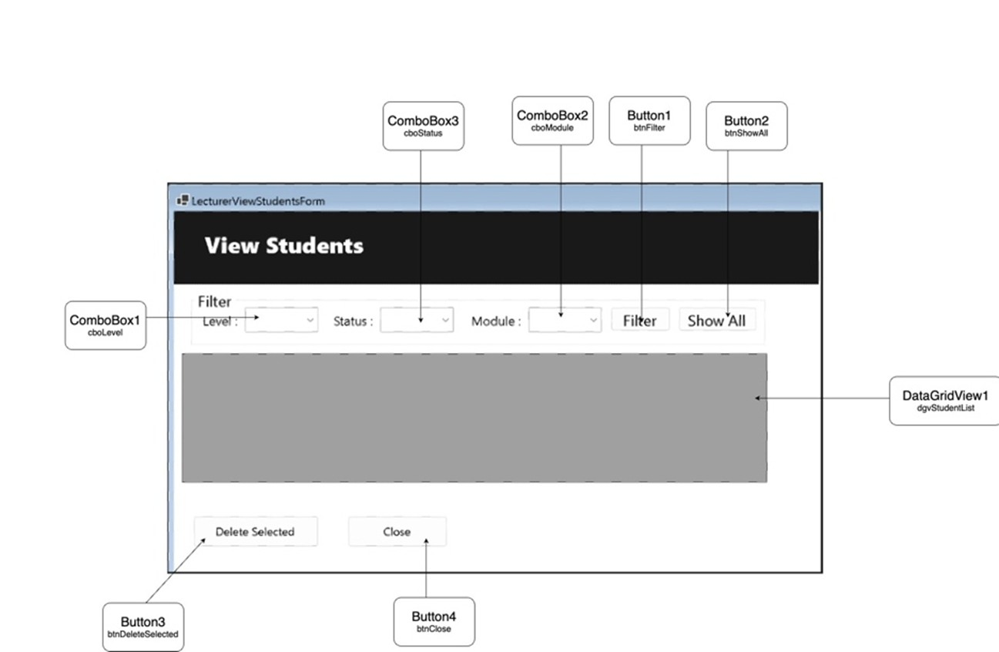

### Trainer

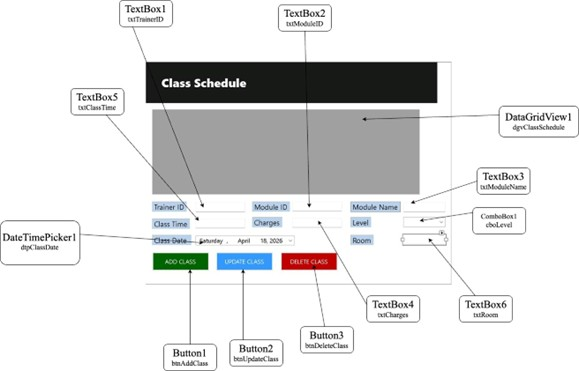

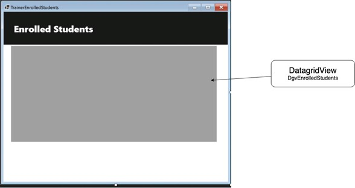

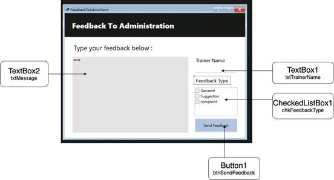

### Student

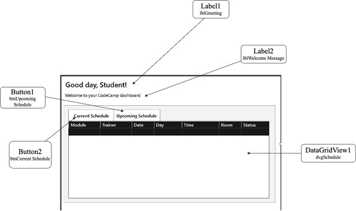

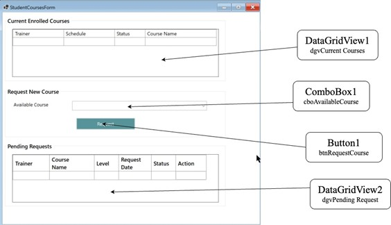

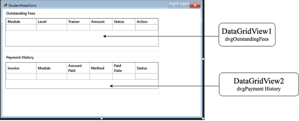

## Setup Summary

1. Open the solution in Visual Studio using `SourceCode/APUCC_Project.slnx`.
2. Create the database by running `Database/schema.sql`.
3. Insert demo records by running `Database/sample-data.sql`.
4. Confirm the connection string in `SourceCode/APUCC/App.config`.
5. Build and run the Windows Forms application.

## Privacy Note

This repository is prepared for portfolio presentation. The database scripts use fictional demo data and exclude private student information, real phone numbers, private passwords, and messy development dump records.
